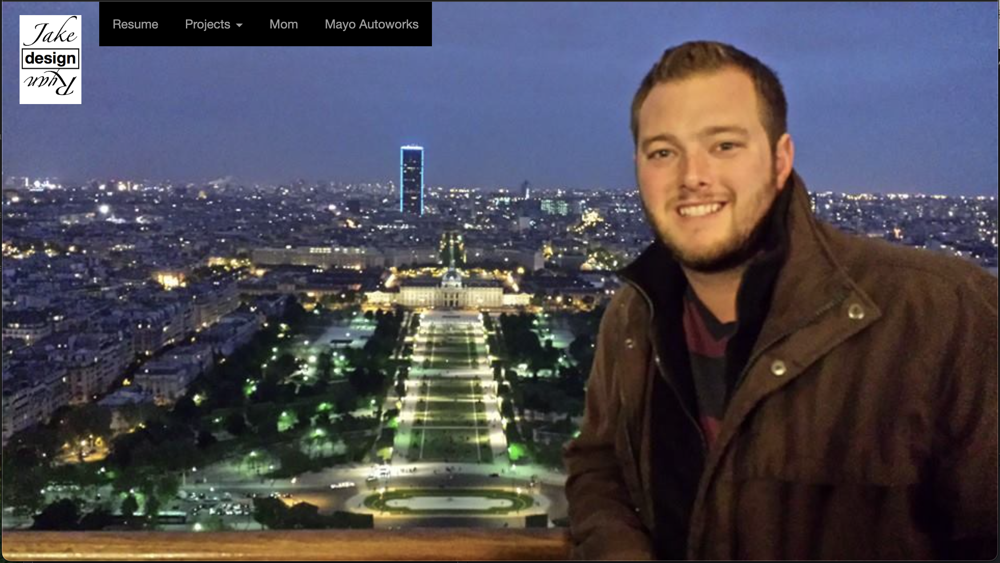

# My First Website (2014)

This project is a personal time capsule—my very first attempt at building a website back in 2014, during my first semester as a computer science student. With no formal web experience at the time, I wanted to create a space to share my resume, showcase a few CLI Java projects I was working on, and honor the memory of my mom, who had recently passed away that year.

The site was originally live at **JakeRyanDesign.com** and hosted through **GoDaddy.com**. It was my first experience purchasing a domain, setting up hosting, and deploying a project to the web—an exciting milestone that gave me a glimpse into the creative and technical possibilities of building for the internet.

## 🌱 Why This Project Matters to Me

This site represents the beginning of my journey into software development. Looking back now, with over a decade of experience in the industry, I’m grateful for how far I’ve come—and proud of where it all started.

I'm uploading this project to GitHub 10 years later, not because it's perfect, but because it’s honest. It's a reminder that we all start somewhere—and that every `
` and `System.out.println()` matters.

## 🚀 How to Run It

You can view the site by opening `src/index.html` in any modern web browser.

> 💡 The site uses [Twitter Bootstrap](https://getbootstrap.com/) for styling (via CDN), so no additional setup is needed.

## 🧰 Tech Stack

- HTML5
- CSS3
- [Twitter Bootstrap](https://getbootstrap.com/)
- Java (CLI programs referenced but not required to view the site)

## 📜 Pages Included

- **Resume Page** – My college resume from 2014
- **Java Projects** – CLI tools and small programs I built to teach myself Java
- **In Memory** – A tribute page for my mom 💙

## 💬 Final Thoughts

This project reminds me that learning, building, and growing takes time—and that it’s okay to look back with humility and a little nostalgia.

Thanks for checking it out.

— Jake Mayo
